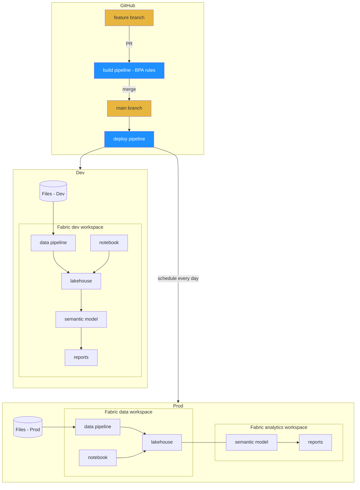

[](https://github.com/RuiRomano/demos-cicd-salessense/actions/workflows/bpa.yml) [](https://github.com/RuiRomano/demos-cicd-salessense/actions/workflows/deploy.yml)


This repository demonstrates a Fabric CI/CD scenario using [fabric-cli](https://aka.ms/fabric-cli) and GitHub. It can be easily adapted to other use cases.  

- Fabric items source code is located in the [/src](/src/) folder.  
- Developers should work in isolation within a feature branch.  
- Pull requests to the main branch trigger a best practices analysis pipeline, [bpa.yml](./.github/workflows/bpa.yml), for both semantic models and reports. This process leverages community tools such as [Tabular Editor](https://github.com/TabularEditor/) and [PBI-Inspector](https://github.com/NatVanG/PBI-InspectorV2).  
- Upon a successful merge into the main branch, the deployment pipeline, [deploy.yml](./.github/workflows/deploy.yml), is triggered to ensure automated deployment to the `development` environment.  
- The deployment pipeline, [deploy.yml](./.github/workflows/deploy.yml), also runs daily on a scheduled trigger to deploy to the `production` environment.  

## Instructions

- Fork the repo.
- Configure required [Github secrets and variables](#secrets-and-variables) in your repo.
- Run the [deploy](/.github/workflows/deploy.yml) Github workflow to deploy into your tenant.

### Run scripts locally

Make sure you have the [Fabric CLI](https://github.com/microsoft/fabric-cli) installed. If not, run:
```bash
$ pip install ms-fabric-cli
```

### Secrets and variables

Before running the Github Action, ensure you configure the following [GitHub action secrets and variables](https://docs.github.com/en/actions/security-for-github-actions/security-guides/using-secrets-in-github-actions):

| Name            | Type   | Value                |
|-----------------|--------|----------------------|
| `FABRIC_CLIENT_ID`       | Secret | [Service Principal](https://learn.microsoft.com/en-us/entra/identity-platform/howto-create-service-principal-portal) client ID from your tenant   |
| `FABRIC_CLIENT_SECRET`   | Secret | Service Principal secret |
| `FABRIC_TENANT_ID` | Secret | Your tenant ID |
| `FABRIC_ADMIN_UPNS` | Variable | User [Entra object ID](https://learn.microsoft.com/en-us/partner-center/account-settings/find-ids-and-domain-names#find-the-user-object-id) that will be assigned to the items created by the service principal |
| `FABRIC_CAPACITY` | Variable | Your [Fabric Capacity](https://learn.microsoft.com/en-us/fabric/admin/capacity-settings?tabs=power-bi-premium) name, required to deploy Fabric items such as data pipelines |

## Topology


